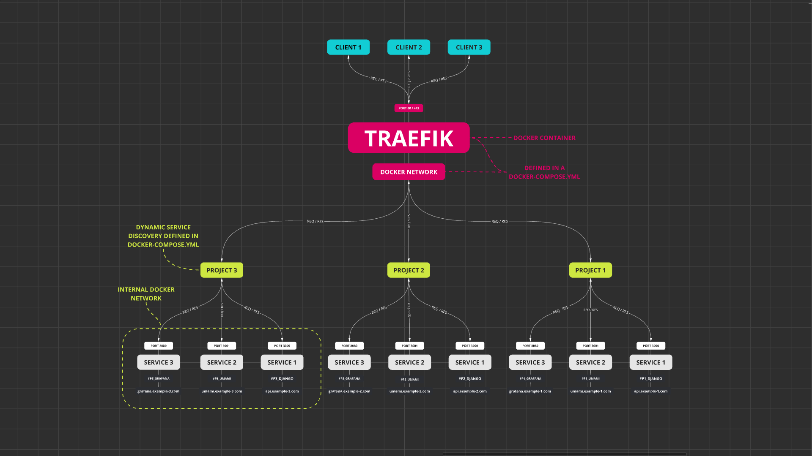

# Traefik Docker VPS Example

This repo demonstrates how to use a single Traefik Docker container as a reverse proxy for multiple projects, each with different domains. Instead of manually installing and configuring a reverse proxy for a server, you can deploy this pre-configured Traefik container and easily add as many projects with as many domains as you need.

```
root/
├── traefik/
│ ├── docker-compose.yml
├── project-1/
│ ├── docker-compose.yml
├── project-2/
│ ├── docker-compose.yml
├── README.md
└── ... (additional projects)
```

## Prerequisites

Before getting started, ensure you have the following installed on your system:

- Docker - [How to install Docker](https://docs.docker.com/get-docker/) (version 20.10.0 or higher)
- Docker Compose - [How to install Docker Compose](https://docs.docker.com/compose/install/) (version 1.27.0 or higher)
- Git - [How to Install Git on Ubuntu](https://www.digitalocean.com/community/tutorials/how-to-install-git-on-ubuntu)
- A registered domain name pointed to your server's IP address - [What are DNS Records?](https://www.cloudflare.com/learning/dns/dns-records/) - [What is a DNS A Record?](https://www.cloudflare.com/learning/dns/dns-records/dns-a-record/)
- Open ports `80` and `443` on your server - [How to Open a Port on a Linux Server Using UFW?](https://www.digitalocean.com/community/tutorials/opening-a-port-on-linux)

## Getting Started

Follow these steps to set up the Traefik reverse proxy and deploy multiple projects.

### 1. Clone the Repository

```bash
git clone https://github.com/johntday/traefik-docker-vps-example.git
```

### 2. Create Docker Network

Traefik and the projects need to communicate over a shared Docker network.

```bash
docker network create traefik-public
```

### 3. Traefik Docker Container

Set up the necessary environment variables for Traefik and each project.

```bash
cd traefik-docker-vps-example/traefik
```

Create a `.env` file inside the `traefik` directory:

```bash
cp .env.example .env
nano .env
```

Edit the `.env` file to set your domain and other necessary variables.

```bash
USERNAME=your_admin_username
PASSWORD=your_admin_password
DOMAIN=yourdomain.com
ACME_EMAIL=youremail@domain.com
```

**Note:** To generate and set the hashed password in one command for Traefik's HTTP Basic Auth, you can use the following command:

```bash
export HASHED_PASSWORD=$(openssl passwd -apr1 $PASSWORD)
```

Then spin up your Traefik container:

```bash
docker compose up -d
```

### 4. Project Docker Containers

For each project, create a `.env` file based on the provided examples and enter the DOMAIN for that project.

```bash
cd ../project-1
cp .env.example .env
nano .env`
```

```bash
DOMAIN=project1.yourdomain.com
```

Then spin up the project container:

```bash
docker compose up -d
```

Repeat for project-2.

### 5. Verify the Setup

Open your browser and navigate to the domains you've configured. You should see the projects running correctly. You can also visit Traefik's dashboard at `https://traefik.yourdomain.com`.
